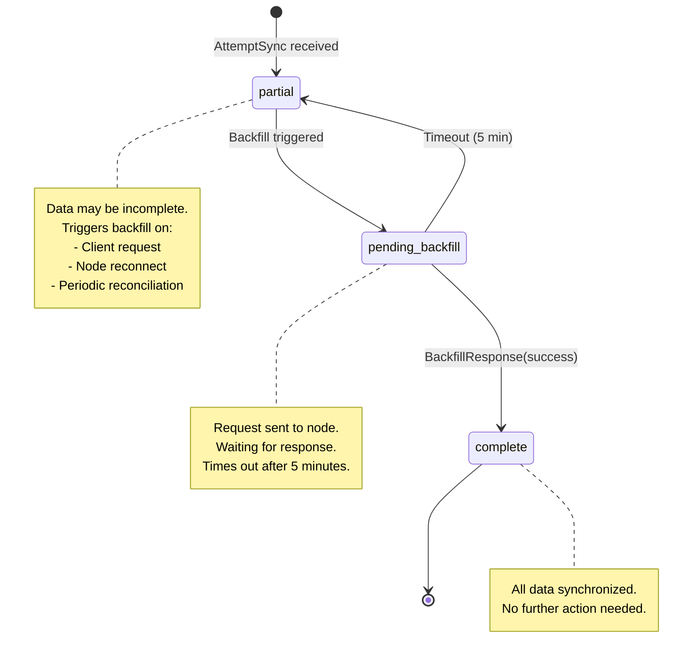
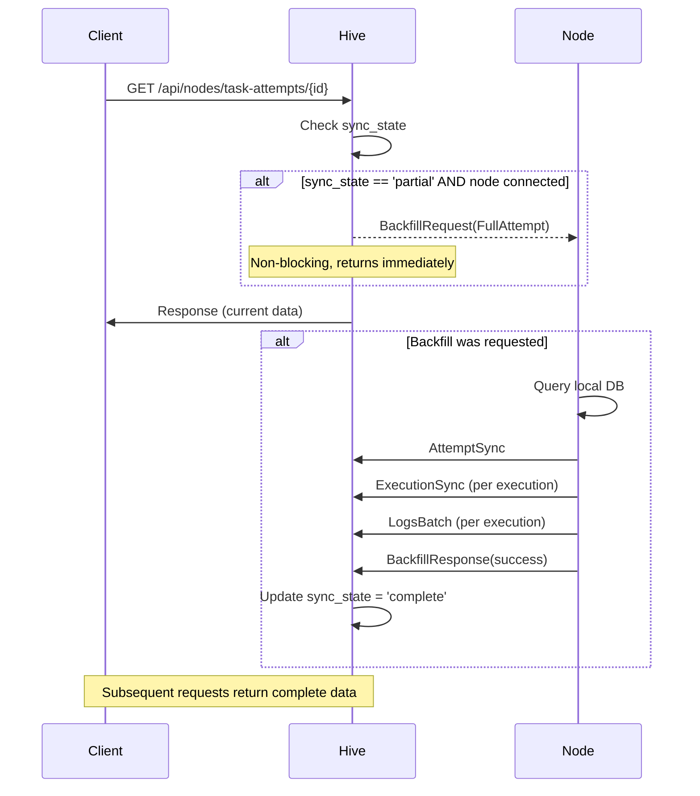
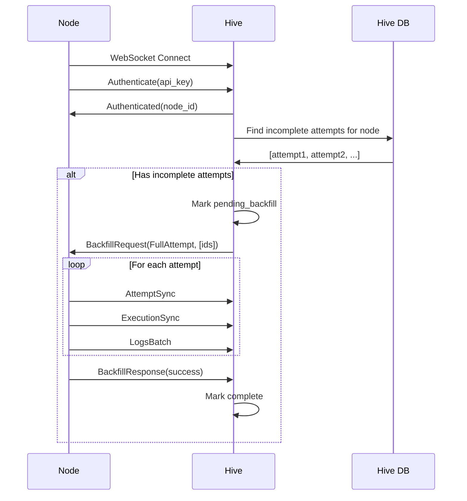
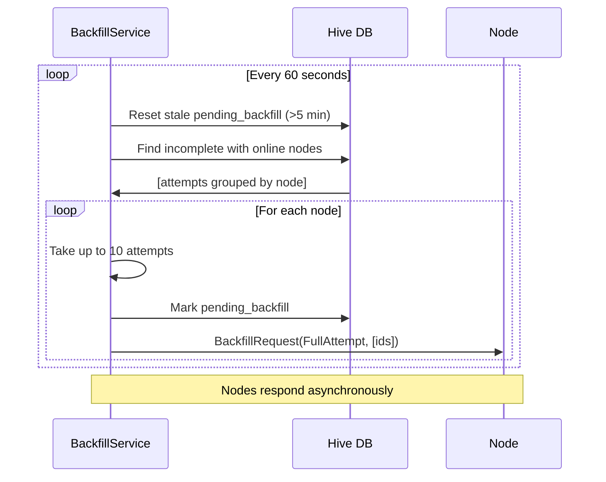

This document describes the technical architecture of execution sync between nodes and the Hive server, including the backfill protocol for ensuring data consistency across the swarm.

## Overview

When a task attempt runs on a node, execution data (attempts, executions, logs) is synced to the central Hive server in real-time. However, if a node goes offline or messages are lost, the Hive may have incomplete data. The **backfill protocol** ensures this data can be recovered when needed.

```text
┌─────────────────────────────────────────────────────────────────────────────┐
│                           EXECUTION SYNC FLOW                                │
├─────────────────────────────────────────────────────────────────────────────┤
│                                                                             │
│  ┌──────────┐          Real-time Sync           ┌──────────────────────┐   │
│  │  Node A  │ ─────────────────────────────────►│   Hive (PostgreSQL)  │   │
│  │ (SQLite) │  AttemptSync, ExecutionSync,      │                      │   │
│  │          │  LogsBatch messages               │  node_task_attempts  │   │
│  └──────────┘                                   │  node_executions     │   │
│       │                                         │  execution_logs      │   │
│       │ Node goes offline                       └──────────────────────┘   │
│       │                                                   │                │
│       ▼                                                   │                │
│  ┌──────────┐                                             │                │
│  │  Node A  │                                             │                │
│  │ (offline)│          sync_state = 'partial'             │                │
│  └──────────┘                                             ▼                │
│       │                                         ┌──────────────────────┐   │
│       │ Node reconnects                         │   Client requests    │   │
│       │                                         │   incomplete attempt │   │
│       ▼                                         └──────────────────────┘   │
│  ┌──────────┐         Backfill Request          ┌──────────────────────┐   │
│  │  Node A  │ ◄─────────────────────────────────│        Hive          │   │
│  │ (online) │  BackfillRequest(FullAttempt)     │                      │   │
│  │          │ ─────────────────────────────────►│                      │   │
│  └──────────┘  AttemptSync, ExecutionSync,      │  sync_state =        │   │
│                LogsBatch, BackfillResponse      │    'complete'        │   │
│                                                 └──────────────────────┘   │
└─────────────────────────────────────────────────────────────────────────────┘
```

### Why Backfill is Needed

Real-time sync works well when nodes maintain persistent WebSocket connections, but data can become incomplete in several scenarios:

1. **Network interruptions**: WebSocket disconnects and messages are lost
2. **Node restarts**: Node comes back online but Hive hasn't received all data
3. **High load**: Messages may be dropped during peak activity
4. **Timing issues**: Attempt starts before WebSocket fully established

The backfill protocol provides a reliable way to recover this data on-demand.

## Sync States

Task attempts on the Hive track their synchronization status via the `sync_state` column:

| State | Description | Next State |
|-------|-------------|------------|
| `partial` | Initial state after attempt sync. Data may be incomplete - executions and logs may not have been received yet. | `pending_backfill` or `complete` |
| `pending_backfill` | A backfill request has been sent to the node. Waiting for the node to respond with missing data. | `partial` (timeout) or `complete` |
| `complete` | All data has been synchronized. The Hive has received a `BackfillResponse` confirming all data was sent. | - |

### State Transition Diagram



### Database Schema

The Hive stores sync state in the `node_task_attempts` table:

```sql
CREATE TABLE node_task_attempts (
    id UUID PRIMARY KEY,
    assignment_id UUID,
    shared_task_id UUID NOT NULL REFERENCES swarm_tasks(id),
    node_id UUID NOT NULL REFERENCES nodes(id),
    executor TEXT NOT NULL,
    executor_variant TEXT,
    branch TEXT NOT NULL,
    target_branch TEXT NOT NULL,
    container_ref TEXT,
    worktree_deleted BOOLEAN NOT NULL DEFAULT FALSE,
    setup_completed_at TIMESTAMPTZ,
    created_at TIMESTAMPTZ NOT NULL,
    updated_at TIMESTAMPTZ NOT NULL,

    -- Sync state tracking
    sync_state TEXT NOT NULL DEFAULT 'partial',
    sync_requested_at TIMESTAMPTZ,
    last_full_sync_at TIMESTAMPTZ
);

-- Partial index for efficient incomplete attempt queries
CREATE INDEX idx_node_task_attempts_incomplete
    ON node_task_attempts(node_id)
    WHERE sync_state != 'complete';
```

## Backfill Triggers

The backfill protocol can be triggered in three ways:

### 1. On-Demand Trigger

When a client requests an attempt that has `sync_state = 'partial'`, the Hive automatically triggers a backfill. This ensures subsequent requests will have complete data.

**Flow:**
1. Client calls `GET /api/nodes/task-attempts/{id}`
2. Hive checks `sync_state` of the attempt
3. If `partial` and node is connected, spawn async backfill request
4. Return current data immediately (non-blocking)
5. Node sends full data in background
6. Subsequent requests return complete data

**Code location:** `crates/remote/src/routes/nodes.rs` in `get_node_task_attempt`

```rust
if attempt.sync_state == "partial" {
    let backfill = state.backfill().clone();
    let node_id = attempt.node_id;
    let attempt_id = attempt.id;

    // Non-blocking - spawn and forget
    tokio::spawn(async move {
        if let Err(e) = backfill.request_immediate_backfill(node_id, attempt_id).await {
            tracing::debug!(
                node_id = %node_id,
                attempt_id = %attempt_id,
                error = %e,
                "on-demand backfill request failed (node may be offline)"
            );
        }
    });
}
```

### 2. Reconnect Trigger

When a node reconnects after being offline, the Hive triggers backfill for any incomplete attempts from that node.

**Flow:**
1. Node establishes WebSocket connection
2. Node sends authentication message
3. After successful auth, Hive triggers reconnect backfill
4. BackfillService queries for incomplete attempts from this node
5. Sends `BackfillRequest` for up to 10 attempts (batch_size)
6. Node responds with full data

**Code location:** `crates/remote/src/nodes/ws/session.rs` in `handle`

```rust
// After successful node authentication
tokio::spawn(async move {
    match backfill.trigger_reconnect_backfill(node_id).await {
        Ok(count) if count > 0 => {
            tracing::info!(node_id = %node_id, count, "triggered reconnect backfill");
        }
        Err(e) => {
            tracing::warn!(node_id = %node_id, error = %e, "reconnect backfill failed");
        }
        _ => {}
    }
});
```

### 3. Periodic Reconciliation

A background task runs every 60 seconds to find and request backfill for any incomplete attempts where the node is currently online.

**Flow:**
1. Every 60 seconds, BackfillService runs reconciliation
2. First, reset any `pending_backfill` attempts that have timed out (>5 min)
3. Query for `partial` attempts where node was seen in last 5 minutes
4. Group attempts by node, send batch requests (up to 10 per node)
5. Log results

**Code location:** `crates/remote/src/nodes/backfill.rs` in `BackfillService::run_periodic_reconciliation`

## Backfill Protocol Messages

### BackfillRequest (Hive → Node)

Sent by the Hive to request data from a node:

```rust
pub struct BackfillRequestMessage {
    /// Unique ID for tracking this request
    pub message_id: Uuid,
    /// Type of backfill requested
    pub backfill_type: BackfillType,
    /// Entity IDs to backfill (attempt IDs for FullAttempt)
    pub entity_ids: Vec<Uuid>,
    /// Optional: only return logs after this timestamp
    pub logs_after: Option<DateTime<Utc>>,
}

pub enum BackfillType {
    /// Request full attempt data: attempt, all executions, all logs
    FullAttempt,
    /// Request only execution records (no logs)
    Executions,
    /// Request only logs (optionally filtered by timestamp)
    Logs,
}
```

### BackfillResponse (Node → Hive)

Sent by the node after processing a backfill request:

```rust
pub struct BackfillResponseMessage {
    /// ID of the original request
    pub request_id: Uuid,
    /// Whether the backfill completed successfully
    pub success: bool,
    /// Error message if failed
    pub error: Option<String>,
    /// Number of entities sent
    pub entities_sent: u32,
}
```

## Sequence Diagrams

### On-Demand Backfill Flow



### Node Reconnect Backfill Flow



### Periodic Reconciliation Flow



## Configuration

The BackfillService is configured via `BackfillConfig`:

| Parameter | Default | Description |
|-----------|---------|-------------|
| `reconciliation_interval` | 60 seconds | How often periodic reconciliation runs |
| `batch_size` | 10 | Maximum attempts to backfill per node per batch |
| `backfill_timeout_minutes` | 5 | Time before `pending_backfill` resets to `partial` |

```rust
pub struct BackfillConfig {
    pub reconciliation_interval: Duration,
    pub batch_size: usize,
    pub backfill_timeout_minutes: i32,
}
```

## Node-Side Handler

When a node receives a `BackfillRequest`, it processes it via `handle_backfill_attempt` in `node_runner.rs`:

**BackfillType::FullAttempt:**
1. Query local `task_attempts` table
2. Query local `tasks` table for `shared_task_id`
3. Send `AttemptSyncMessage`
4. For each execution:
   - Send `ExecutionSyncMessage`
   - Query and send `LogsBatchMessage`
5. Return count of entities sent

**BackfillType::Executions:**
1. Query executions for the attempt
2. Send `ExecutionSyncMessage` for each
3. Return count

**BackfillType::Logs:**
1. Query executions for the attempt
2. For each execution, query logs (optionally filtered by `logs_after`)
3. Send `LogsBatchMessage` for each execution with logs
4. Return total log count

## Troubleshooting

### Cross-node attempts show incomplete data

**Symptoms:**
- Viewing an attempt from another node shows missing executions or logs
- `sync_state` is `partial` in the database

**Diagnosis:**
1. Check if the source node is connected:
   ```sql
   SELECT id, name, last_seen_at
   FROM nodes
   WHERE id = '<node_id>';
   ```

2. Check sync state:
   ```sql
   SELECT id, sync_state, sync_requested_at, last_full_sync_at
   FROM node_task_attempts
   WHERE id = '<attempt_id>';
   ```

3. Check server logs for backfill errors:
   ```bash
   grep "backfill" /var/log/vibe-kanban/server.log | tail -50
   ```

**Resolution:**
- If node is offline: Data will sync when node reconnects
- If node is online but sync_state is partial: Trigger manual backfill via API request
- If periodic reconciliation isn't running: Check BackfillService startup logs

### Backfill not triggering

**Symptoms:**
- `sync_state` remains `partial` even with node online
- No backfill-related log entries

**Diagnosis:**
1. Verify BackfillService is initialized:
   ```bash
   grep "BackfillService" /var/log/vibe-kanban/server.log
   ```

2. Check node connection status:
   ```sql
   SELECT id, name, last_seen_at,
          CASE WHEN last_seen_at > NOW() - INTERVAL '5 minutes'
               THEN 'online' ELSE 'offline' END as status
   FROM nodes;
   ```

3. Verify periodic reconciliation is running:
   ```bash
   grep "periodic reconciliation" /var/log/vibe-kanban/server.log
   ```

**Resolution:**
- Ensure `BackfillService::spawn()` is called in server startup
- Check WebSocket connection health
- Verify node is authenticating successfully

### Backfill timeouts

**Symptoms:**
- `sync_state` keeps cycling between `partial` and `pending_backfill`
- `sync_requested_at` is being updated but `last_full_sync_at` never set

**Diagnosis:**
1. Check node-side logs for backfill handler errors
2. Verify node can query its local database
3. Check network latency between node and Hive

**Resolution:**
- Increase `backfill_timeout_minutes` if network is slow
- Check node logs for database query errors
- Ensure node has sufficient resources to process backfill

### Large log volumes causing timeouts

**Symptoms:**
- Backfill requests timeout for attempts with many logs
- Node logs show long-running queries

**Diagnosis:**
1. Count logs for the attempt:
   ```sql
   SELECT COUNT(*) FROM log_entries
   WHERE execution_id IN (
       SELECT id FROM execution_processes WHERE task_attempt_id = '<attempt_id>'
   );
   ```

**Resolution:**
- Use `BackfillType::Logs` with `logs_after` timestamp for incremental sync
- Consider archiving old logs
- Increase database connection pool size on node

## Related Documentation

- [Swarm Sync Architecture](/architecture/swarm-sync) - Overall swarm synchronization
- [Swarm/Hive Setup Guide](/swarm-hive-setup) - Configuration instructions
- [Storage Paths](/architecture/storage-paths) - Database and log locations
